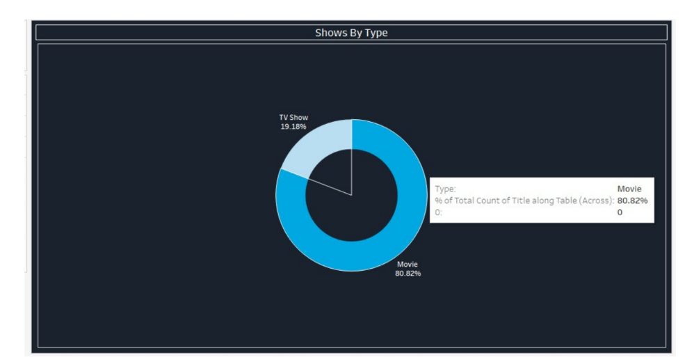
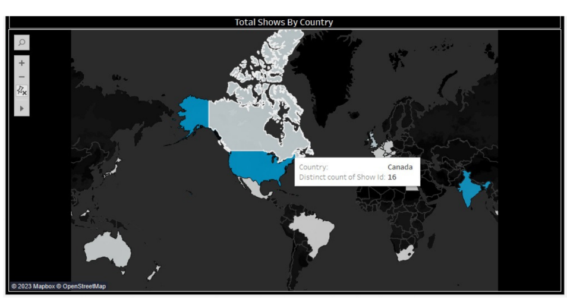
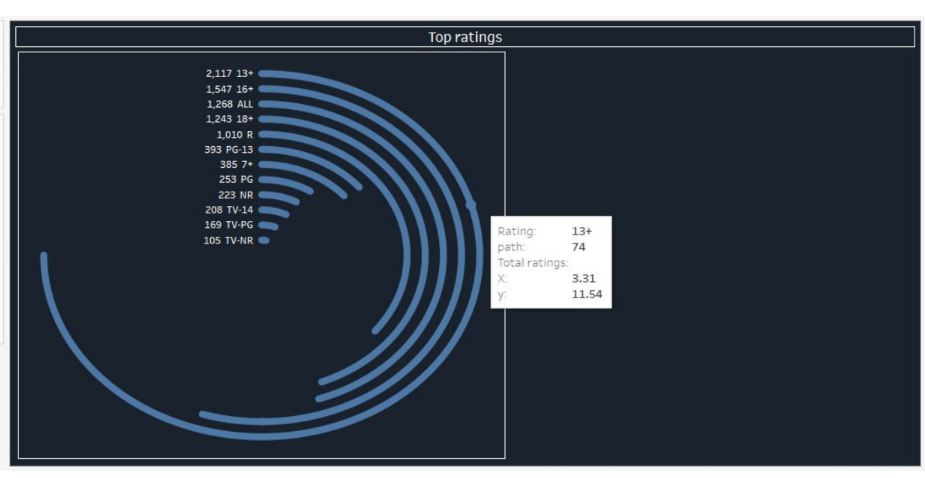
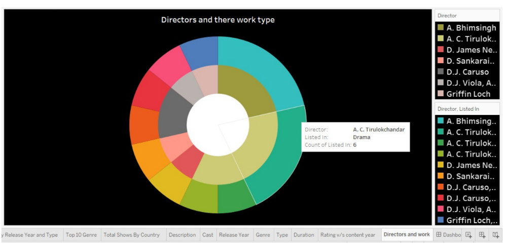
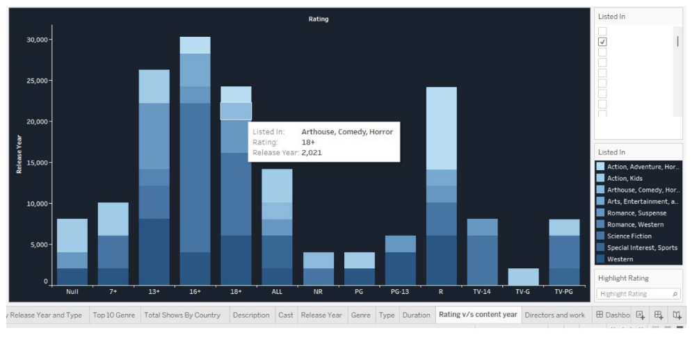
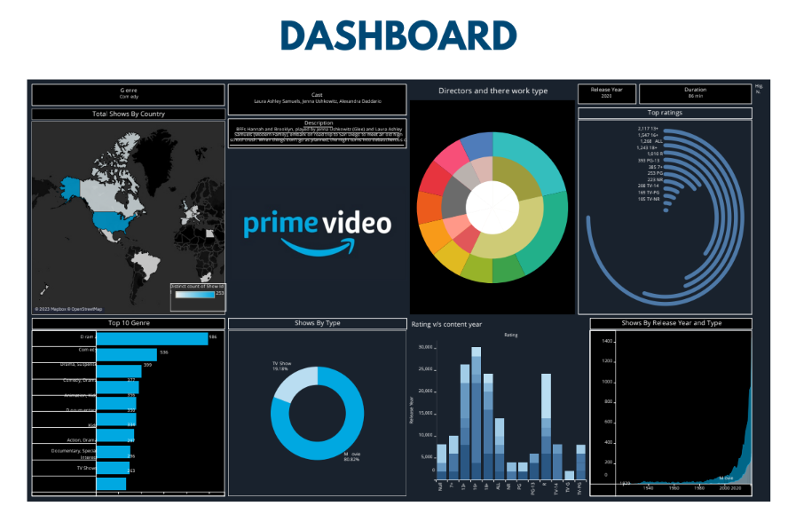

# 🎬 Amazon Prime Video Content Analysis

## 📌 Project Overview
Amazon Prime Video is a leading global streaming platform with over **200 million subscribers**. This project aims to analyze the **content trends** on Prime Video from **1910 to 2021**, including:
- **Movies vs. TV Shows** distribution
- **Genre popularity trends**
- **Viewer rating distribution**
- **Regional content contributions**
- **Directors and their contributions**
- **Evolution of content over the years**

📊 **The analysis was conducted using**:
- **Python** (Pandas, Matplotlib, Seaborn)
- **Tableau** (for visualizations and dashboards)

---

## 📂 Dataset Description
The dataset used contains metadata about **movies and TV shows** on Amazon Prime Video, including:
- 🎥 **Type**: Movie or TV Show
- 🎭 **Title**
- 🎬 **Director**
- 🎭 **Cast**
- 🌍 **Country**
- 🗓 **Date Added**
- 📅 **Release Year**
- ⭐ **Ratings**
- ⏳ **Duration** (or number of seasons for TV Shows)
- 🎭 **Genre**
- 📝 **Description**

---

## 📊 Exploratory Data Analysis (EDA)

### 🎥 **Content Type Distribution**
Amazon Prime Video predominantly offers **movies** over TV Shows.



- **Movies**: **80.82%** of total content
- **TV Shows**: **19.18%** of total content
- Prime Video prioritizes movies over serialized TV content.

---

### 🎭 **Top 10 Genres**
Understanding genre popularity helps identify viewer preferences.


- **Drama** and **Comedy** dominate the platform.
- Other top genres: **Suspense, Animation, Kids, and Documentary**.
- A strong focus on **family and drama-oriented content**.

---

### 🌍 **Content Production by Country**
The majority of content comes from a **few leading countries**.



- **United States** has the most content on Amazon Prime Video.
- **India** is the second-largest contributor, reflecting the rise of Bollywood and regional content.
- **United Kingdom** also has a strong presence.

---

### ⭐ **Viewer Ratings Distribution**
Content is categorized based on viewer ratings.



- **Most content is rated 13+ and 16+**, indicating a focus on **teen and young adult audiences**.
- A significant portion of content is rated **"ALL"**, making it suitable for family viewing.

---

### 🎬 **Top Directors and Their Work**
A few directors dominate the content production.



- Certain directors specialize in **specific genres**.
- **Drama-based directors** have the highest number of contributions.

---

### 📈 **Ratings vs. Content Year**
Understanding how content has evolved over time.



- A **sharp increase** in content production post-2000.
- **Streaming boom after 2015**, resulting in a massive influx of content.

---

## 📊 Tableau Dashboard
The analysis was visualized using **Tableau**, featuring interactive elements for better insights.



### **Key Dashboard Components:**
- 📊 **Bar Chart:** Movies vs. TV Shows distribution
- 📈 **Line Chart:** Content trends over the years
- 📊 **Stacked Bar Chart:** Viewer ratings across different years
- 🌍 **Geospatial Map:** Content production by country
- 🎭 **Tree Map:** Top directors based on content count
- 🎭 **Bubble Chart:** Most frequently featured actors

---

## 🏆 **Key Takeaways**
- **Prime Video focuses more on movies** (80.82%) than TV shows (19.18%).
- **Drama and Comedy are the most dominant genres**.
- The majority of content originates from **United States, India, and UK**.
- **Viewer preferences** lean toward **13+ and 16+ age ratings**.
- **Significant content expansion post-2015** due to the streaming boom.

---

## 🚀 **Future Work**
To enhance this analysis, potential future improvements include:
- **Analyzing user engagement patterns** to predict content preferences.
- **Comparing Amazon Prime Video with competitors** (Netflix, Disney+).
- **Examining the impact of original productions vs. licensed content**.
- **Sentiment analysis** of reviews to determine audience reception.

---

## 📜 **References**
- **Dataset Source:** [Kaggle - Amazon Prime Video Dataset](https://www.kaggle.com)
- **Dashboard Implementation:** [Tableau Public](https://www.tableau.com)

---

## 📌 **How to Use This Repository**
1. Clone the repository:
   ```bash
   git clone https://github.com/yourusername/Amazon-Prime-Video-Analysis.git
Install dependencies:
bash
Copy
Edit
pip install pandas matplotlib seaborn
Run the analysis:
bash
Copy
Edit
python analysis.py
Open Tableau and load the .twb file to explore the interactive dashboard.
